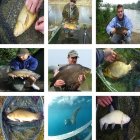

# Implementation of "Ambient Sound Provides Supervision for Visual Learning" using PyTorch

### Full report can be read in the PDF - <a href="./Improving_Visual_Recognition_using_Ambient_Sound_for_Supervision.pdf">Here</a>

### Original paper can be read here - https://arxiv.org/pdf/1608.07017.pdf

0. Install requirements from `requirements.txt`

0.1. Install ffmpeg - https://ffmpeg.org/download.html

0.2. Download pretrained weights - https://drive.google.com/drive/folders/1dqdUiZIlkR3SiaK8tayLaUR0WejKqsct?usp=sharing

1. Download AudioSet

`cat eval_segments.csv | ./download.sh`

2. Extract frames and audio separately from AudioSet

`python create_dataset.py`

3.1 Save statistical summary features:

`python feature_saver.py`

or

3.2 Save MFCC features:

`python get_mfcc.py` - This creates HDF5 files which are used for training.

4. Train the pretext model:

`python pretext_train_5_alexnet.py` or `python pretext_train_5_resnet.py`

5. Evaluate on Pascal VOC classification:

(Download VOC dataset first)
`python download_voc.py`

`python finetune_voc.py`

6. Evaluate linear classifier on Imagenet:

`python linear_imagenet_classifier.py`
 
7. Visualize learned models:

7.1 Gradient Ascent:
`python grad_ascent.py`

7.2 Top activation retrieval:
`python activ_retrieval.py dataset_path pretext_model_arch pretext_model_path conv_layer(1/2/3/4/5) output_location`
E.g, `python activ_retrieval.py /path/to/imagenet alexnet /path/to/model.pth 5 /path/to/output`

Authors: Rohan Mahadev, Florence Lu

(Might be unstable, might have to make some changes to hardcoded paths to run) 
