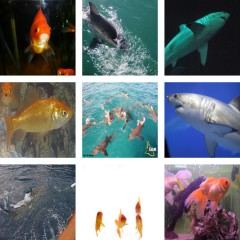

# Implementation of "Ambient Sound Provides Supervision for Visual Learning" using PyTorch

### Full report can be read in the PDF - <a href="./report/Improving_Visual_Recognition_using_Ambient_Sound_for_Supervision.pdf">Here</a>

### Original paper can be read here - https://arxiv.org/pdf/1608.07017.pdf

0. Install requirements from `requirements.txt`

0.1. Install ffmpeg - https://ffmpeg.org/download.html

0.2. Download pretrained weights - https://drive.google.com/drive/folders/1dqdUiZIlkR3SiaK8tayLaUR0WejKqsct?usp=sharing

1. Download AudioSet
`cat utils/eval_segments.csv | bash ./utils/download_audioset.sh`

2. Extract frames and audio separately from AudioSet

`python utils/create_dataset.py /path/to/audioset_videos`

3.1.2 Save statistical features and generate trainable HDF5 files:

This creates HDF5 files which are used for training.

`python pretext_training/get_statistical_summaries.py /path/to/audio/files /place/to/store/resulting/files number_of_clusters(5/10/15/30/60) /path/to/frames`

or

3.2.1 Save MFCC features and generate trainable HDF5 files:

This creates HDF5 files which are used for training.

`python pretext_training/get_mfcc.py /path/to/audio/files /place/to/store/resulting/files number_of_clusters(5/10/15/30/60) /path/to/frames`  

4. Train the pretext model:
(This has a lot of experimentation involved to make it work. Go through the file and make changes as per your need)
(I have kept my original code as it with hard coded paths so that you get an idea of what goes where)

`python pretext_training/pretext_train_5_alexnet.py` or `pretext_training/python pretext_train_5_resnet.py`

5. Evaluate on Pascal VOC classification:

(Download VOC dataset first)
`python utils/download_voc.py`

(This follows evaluation parameters as set in  https://github.com/facebookresearch/deepcluster/)
`python downstream_evaluation/finetune_voc.py (head/all) number_of_clusters /path/to/pretext/model.pth /path/to/VOC2007/folder` 
E.g. `python finetune_voc.py head 5 mfcc-alexnet-model_5.pt `

6. Evaluate linear classifier on Imagenet:

`python linear_imagenet_classifier.py`
 
7. Visualize learned models:

7.1 Gradient Ascent:
(As proposed by Yosinski et. al, modified code from https://github.com/facebookresearch/deepcluster/)
`python grad_ascent.py` 
A good help with this is to read instructions in the deepcluster repo.

7.2 Top activation retrieval:
`python activ_retrieval.py dataset_path pretext_model_arch pretext_model_path conv_layer(1/2/3/4/5) output_location`
E.g. `python activ_retrieval.py /path/to/imagenet alexnet /path/to/model.pth 5 /path/to/output`

The images in the repo are generated using this above script and are teh top activated images for filter number 7 and 117 respectively in CONV layer 3 for our pretext AlexNet model using Statistical summaries features. 

Authors: Rohan Mahadev, Florence Lu